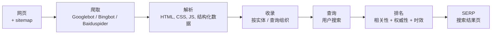

# SEO 基础 — 是什么与小站如何被收录

**SEO（Search Engine Optimization，搜索引擎优化）**是让网页被
搜索引擎**发现、可爬取、可收录、可竞争**的实践。对小站来说，
重点通常在前三项——让搜索引擎能**找到、读懂、信任**页面——
然后再考虑为竞争性关键词排到第 1 位。

本文是 SEO 专题文库的第一篇，覆盖基础。**按引擎的具体指南**在
后续文章中（Google、Bing、Yahoo、DuckDuckGo、Baidu、Shenma）。

> **TL;DR。** SEO = **爬取 → 收录 → 排名**。要被收录：提交
> sitemap、写合理的 `robots.txt`、用结构化数据（JSON-LD /
> Schema.org）、拿一些高质量的反向链接，然后等。小站通常几天
> 到几周就能被收录，前提是做到了上面这些。

## 什么是 SEO？

SEO 是提升页面在自然（非付费）搜索结果中可见度的实践。它有
三个阶段：

1. **爬取（Crawl）。** 搜索引擎爬虫（Googlebot、Bingbot、
   Baiduspider 等）抓取页面。
2. **收录（Index）。** 爬虫处理页面并存入引擎索引，按实体
   与查询组织。
3. **排名（Rank）。** 用户搜索时，引擎按相关性 + 权威性 + 时效
   性等给已收录页面打分，并返回前几条。SEO 的实践就是影响
   每个阶段：爬取——确保页面可达且快；收录——确保页面可解析、
   有结构化数据、有内链；排名——通过反向链接、内容质量、
   E-E-A-T 信号建立权威。

## 搜索引擎如何工作 — 流水线



五个阶段。SEO 在每个阶段都有杠杆：

| 阶段 | 发生什么 | SEO 杠杆 |
| --- | --- | --- |
| **爬取** | 爬虫抓取页面。 | `robots.txt` 允许；服务器快；无坏链。 |
| **解析** | 解析 HTML / CSS / JS / 图像。 | 干净的标记；图片懒加载；JS 服务端渲染。 |
| **收录** | 页面存入索引。 | 结构化数据（JSON-LD / Schema.org）、meta 标签、sitemap。 |
| **排名** | 查询匹配索引；排名算法打分。 | 内容质量、反向链接、E-E-A-T、Core Web Vitals。 |
| **展示** | 把前几条结果展示给用户。 | 标题、描述、富结果资格。 |

## 小站如何快速被收录

小站最常见的 SEO 问题是"我的新页面没出现在 Google 里"。下面是
清单。

### 1. 提交 sitemap

**sitemap** 是列出每个你想被收录 URL 的 XML 文件。大多数搜索
引擎通过各自的站长工具接收 sitemap。

```xml
<?xml version="1.0" encoding="UTF-8"?>
<urlset xmlns="http://www.sitemaps.org/schemas/sitemap/0.9">
  <url>
    <loc>https://example.com/</loc>
    <lastmod>2026-09-22</lastmod>
    <changefreq>weekly</changefreq>
    <priority>1.0</priority>
  </url>
  <url>
    <loc>https://example.com/about</loc>
    <lastmod>2026-09-20</lastmod>
  </url>
</urlset>
```

提交位置：

- **Google：** [Search Console](https://search.google.com/search-console) → Sitemaps。
- **Bing：** [Webmaster Tools](https://www.bing.com/webmasters) → Sitemaps。
- **百度：** [搜索资源平台](https://ziyuan.baidu.com/) → sitemap 提交。

### 3. 用合理的 `robots.txt`

`robots.txt` 在域名根目录。它告诉爬虫能抓什么。

```txt
# 默认允许所有
User-agent: *
Allow: /

# 屏蔽管理面板
Disallow: /admin/

# sitemap 位置
Sitemap: https://example.com/sitemap.xml
```

常见错误：

- **屏蔽 CSS / JS。** 搜索引擎需要它们来渲染页面；屏蔽会伤排名。
- **屏蔽整个站。** 容易打错。
- **没声明 sitemap。** 加 `Sitemap:` 行。

### 4. 用结构化数据（JSON-LD / Schema.org）

结构化数据帮助搜索引擎理解页面。大多搜索引擎用它启用富结果
（FAQ 手风琴、文章卡片、商品卡片）。

```html
<script type="application/ld+json">
{
  "@context": "https://schema.org",
  "@type": "Article",
  "headline": "SEO 基础 — 是什么与小站如何被收录",
  "author": {
    "@type": "Organization",
    "name": "x-cmd"
  },
  "datePublished": "2026-09-22",
  "dateModified": "2026-09-22",
  "publisher": {
    "@type": "Organization",
    "name": "x-cmd"
  }
}
</script>
```

常见类型：

| 类型 | 用途 |
| --- | --- |
| `Article` | 博客、新闻、编辑内容。 |
| `Product` | 电商商品页。 |
| `FAQPage` | 多 Q&A 的 FAQ。 |
| `HowTo` | 分步说明。 |
| `Organization` | 公司 / 项目主页。 |
| `BreadcrumbList` | 面包屑导航。 |
| `WebSite` + `SearchAction` | 站内搜索框（SERP 显示）。 |

### 5. 拿反向链接

反向链接是其他站指向你的链接。在 Google 和 Bing，这是 #1 的
**页外**排名信号。

对小站：

- **提交到目录。** Hacker News、Product Hunt、GitHub trending、
  相关 subreddit、利基目录。
- **客座文章。** 在你领域的其他博客写文章，带回链。
- **原创研究。** 发布别人会引用的数据或分析。
- **媒体 / 提及。** 公告发布；回复 HARO / Qwoted 上的记者问询。

避免：

- **链接农场。** Google 惩罚。
- **付费链接。** Google 指南不允许；可导致人工操作。

### 6. 等——并查看覆盖率

提交 sitemap 后，期待：

- **Google：** 小站 1-7 天。页面有内链 + 外链则更快。
- **Bing：** 通常比 Google 快（小时到天）。
- **百度：** 最慢；新站 1-4 周。百度对部分内容还要求 ICP 备案。

在每个引擎的站长工具查看覆盖率。各引擎文章里有具体 URL。

## 排名因素 — 什么真的重要

2026 年的清单（以 Google 为中心；Bing 和百度类似但不完全一致）：

### 内容

- **质量 + 原创性。** 长篇原创内容赢。
- **E-E-A-T。** 经验、专业性、权威性、可信度。对 YMYL（Your
  Money or Your Life）话题尤其重要。
- **时效性。** 时间敏感查询更喜欢新的。
- **搜索意图匹配。** 页面是否回答了查询？

### 技术

- **Core Web Vitals。** LCP（Largest Contentful Paint）、
  INP（Interaction to Next Paint）、CLS（Cumulative Layout
  Shift）。都"良好"才有竞争力。
- **移动友好。** 自 2018 年起移动优先索引。
- **HTTPS。** 自 2014 年起必需。
- **结构化数据。** 帮助富结果。

### 页外

- **反向链接。** #1 页外因素。
- **品牌提及。** 即便未链接的提及也算。
- **域名权威。** 经年累加。

### 用户信号

- **SERP 点击率。** 标题 + 描述很重要。
- **停留时间。** 用户跳回 SERP 说明页面不匹配。
- **跳出率。** 类似信号。

## 小站常见 SEO 错误

- **没内链。** 页面之间不互相引用；爬虫找不到。
- **纯 JS 渲染。** 爬虫看到空白页面。用服务端渲染或预渲染。
- **页面慢。** Core Web Vitals 重要；LCP > 2.5s 会输。
- **重复内容。** 多个 URL 提供相同内容。用 canonical 标签。
- **薄内容。** 页面少于 300 字几乎不排名。
- **买链接。** 危险；可导致人工操作。
- **关键词堆砌。** 隐藏真实内容；被惩罚。
- **忘记移动。** 移动优先索引是真的。
- **没有结构化数据。** 错过富结果。
- **收录慢。** 提交了 sitemap 但没 ping IndexNow / Bing。

## 小站 SEO 必备工具

| 工具 | 用途 | 费用 |
| --- | --- | --- |
| **Google Search Console** | 收录状态、查询、人工操作。 | 免费 |
| **Bing Webmaster Tools** | Bing 同上。 | 免费 |
| **百度搜索资源平台** | 百度同上。 | 免费 |
| **IndexNow** | 即时 URL 提交给 Bing、Yandex、Seznam 等。 | 免费 |
| **Lighthouse** | Core Web Vitals + 无障碍审计。 | 免费，Chrome 内置 |
| **PageSpeed Insights** | 云端 Lighthouse。 | 免费 |
| **Ahrefs / Semrush / Moz** | 反向链接 + 关键词研究。 | 付费 |
| **Screaming Frog** | 抓取你的站；找坏链等。 | Freemium |
| **schema.org 验证器** | 验证结构化数据。 | 免费 |

## 速查清单 — 首次收录

新站 30 分钟清单：

- [ ] 域名已注册且 DNS 解析。
- [ ] 站用 HTTPS 提供。
- [ ] `robots.txt` 在根目录且没屏蔽站。
- [ ] `sitemap.xml` 列出每个重要页面。
- [ ] 每个页面有唯一的 `<title>` 与 `<meta name="description">`。
- [ ] 主页上至少一块结构化数据。
- [ ] Google Search Console：验证域名，提交 sitemap。
- [ ] Bing Webmaster Tools：验证，提交 sitemap。
- [ ] 百度搜索资源平台：验证，提交 sitemap。
- [ ] IndexNow：提交 URL（Bing / Yandex / Seznam 即时收录）。
- [ ] Lighthouse：LCP < 2.5s、INP < 200ms、CLS < 0.1。

## 下一步？

- **2-google-seo** — 谷歌专属 SEO + Search Console。
- **3-bing-indexnow** — Bing + IndexNow 协议。
- **4-yahoo** — Yahoo Search。
- **5-duckduckgo** — DuckDuckGo。
- **6-baidu** — 百度。
- **7-shenma** — 神马（移动端）。

## 源码与官方资源

- **Google Search Central：** <https://developers.google.com/search>
- **Bing Webmaster Tools：** <https://www.bing.com/webmasters>
- **IndexNow：** <https://www.indexnow.org/>
- **Schema.org：** <https://schema.org/>
- **百度搜索资源平台：** <https://ziyuan.baidu.com/>