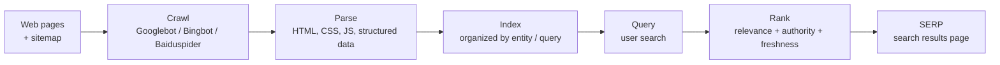

# SEO Basics — What It Is and How Small Sites Get Indexed

**SEO (Search Engine Optimization)** is the practice of making
web pages discoverable, crawlable, indexable, and competitive
in search engine results. For small sites, the focus is
usually on the first three — making sure search engines can
**find, read, and trust** the page — before worrying about
ranking #1 for competitive keywords.

This page is the first article in the SEO topic library. It
covers the fundamentals. Per-engine guidance lives in the
follow-up articles (Google, Bing, Yahoo, DuckDuckGo, Baidu,
Shenma).

> **TL;DR.** SEO = **Crawl → Index → Rank**. To get indexed:
> submit a sitemap, write a sensible `robots.txt`, use
> structured data (JSON-LD / Schema.org), get a few quality
> backlinks, and wait. Small sites can usually get indexed in
> days to weeks if they do.

## What is SEO?

SEO is the practice of improving a page's visibility in
organic (non-paid) search results. It has three stages:

1. **Crawl.** A search engine's crawler (Googlebot, Bingbot,
   Baiduspider, …) fetches the page.
2. **Index.** The crawler processes the page and stores it in
   the engine's index, organized around entities and queries.
3. **Rank.** When a user searches, the engine ranks indexed
   pages by relevance + authority + freshness + … and serves
   the top results.

SEO is the practice of influencing each stage. Crawl: make
sure the page is reachable and fast. Index: make sure the
page is parseable, has structured data, and is internally
linked. Rank: build authority via backlinks, content quality,
and E-E-A-T signals.

## How search engines work — the pipeline



Five stages. SEO works on each:

| Stage | What happens | SEO lever |
| --- | --- | --- |
| **Crawl** | Crawler fetches the page. | `robots.txt` allows, server is fast, no broken links. |
| **Parse** | HTML / CSS / JS / images are parsed. | Clean markup, lazy-load images, server-side rendering for JS. |
| **Index** | Page is stored in the index. | Structured data (JSON-LD / Schema.org), meta tags, sitemap. |
| **Rank** | Query matches index; ranking algo scores pages. | Content quality, backlinks, E-E-A-T, Core Web Vitals. |
| **SERVE** | Top results shown to user. | Title tag, meta description, rich results eligibility. |

## How small sites get indexed fast

The most common SEO problem small sites face is "my new page
isn't appearing in Google." Here is the checklist.

### 1. Submit a sitemap

A **sitemap** is an XML file listing every URL you want
indexed. Most search engines accept sitemaps via their
respective webmaster tools.

```xml
<?xml version="1.0" encoding="UTF-8"?>
<urlset xmlns="http://www.sitemaps.org/schemas/sitemap/0.9">
  <url>
    <loc>https://example.com/</loc>
    <lastmod>2026-09-22</lastmod>
    <changefreq>weekly</changefreq>
    <priority>1.0</priority>
  </url>
  <url>
    <loc>https://example.com/about</loc>
    <lastmod>2026-09-20</lastmod>
  </url>
</urlset>
```

Where to submit:

- **Google:** [Search Console](https://search.google.com/search-console) → Sitemaps.
- **Bing:** [Webmaster Tools](https://www.bing.com/webmasters) → Sitemaps.
- **Baidu:** [搜索资源平台](https://ziyuan.baidu.com/) → sitemap 提交.

### 3. Use a sensible `robots.txt`

`robots.txt` lives at the root of your domain. It tells
crawlers what they may fetch.

```txt
# Allow everything by default
User-agent: *
Allow: /

# Block the admin panel
Disallow: /admin/

# Sitemap location
Sitemap: https://example.com/sitemap.xml
```

Common mistakes:

- **Blocking CSS / JS.** Search engines need them to render
  the page; blocking hurts ranking.
- **Blocking the whole site.** Easy typo to make.
- **No sitemap declared.** Add the `Sitemap:` line.

### 4. Use structured data (JSON-LD / Schema.org)

Structured data helps search engines understand the page.
Most search engines use it to enable rich results (FAQ
accordion, article card, product card).

```html
<script type="application/ld+json">
{
  "@context": "https://schema.org",
  "@type": "Article",
  "headline": "SEO Basics — What It Is and How Small Sites Get Indexed",
  "author": {
    "@type": "Organization",
    "name": "x-cmd"
  },
  "datePublished": "2026-09-22",
  "dateModified": "2026-09-22",
  "publisher": {
    "@type": "Organization",
    "name": "x-cmd"
  }
}
</script>
```

Common types:

| Type | Use |
| --- | --- |
| `Article` | Blog post, news, editorial. |
| `Product` | E-commerce product page. |
| `FAQPage` | FAQ with multiple Q&A. |
| `HowTo` | Step-by-step instructions. |
| `Organization` | Company / project homepage. |
| `BreadcrumbList` | Breadcrumb navigation. |
| `WebSite` + `SearchAction` | Site-wide search box in SERPs. |

### 5. Get backlinks

Backlinks are links from other sites to yours. They are the
#1 off-page ranking signal for Google and Bing.

For small sites:

- **Submit to directories.** Hacker News, Product Hunt, GitHub
  trending, relevant subreddit, niche directories.
- **Guest posts.** Write articles for other blogs in your
  niche with a link back.
- **Original research.** Publish data or analysis others cite.
- **Press / mentions.** Announce launches; reply to journalist
  queries on HARO / Qwoted.

Avoid:

- **Link farms.** Google penalizes them.
- **Paid links.** Google's guidelines disallow them; can lead
  to manual action.

### 6. Wait — and check coverage

After submitting a sitemap, expect:

- **Google:** 1-7 days for small sites. Faster if the page
  has internal + external links.
- **Bing:** Faster than Google in many cases (hours to days).
- **Baidu:** Slowest; 1-4 weeks for new sites. Baidu also
  requires an ICP备案 (Chinese filing) for some types of
  content.

Check coverage in each engine's webmaster tool. See per-
engine articles for the exact URL.

## Ranking factors — what actually matters

A 2026 list (Google-centric; Bing and Baidu have similar
but not identical factors):

### Content

- **Quality + originality.** Long-form, original content wins.
- **E-E-A-T.** Experience, Expertise, Authoritativeness,
  Trustworthiness. Especially important for YMYL (Your Money
  or Your Life) topics.
- **Freshness.** Newer is better for time-sensitive queries.
- **Search intent match.** Does the page answer the query?

### Technical

- **Core Web Vitals.** LCP (Largest Contentful Paint), INP
  (Interaction to Next Paint), CLS (Cumulative Layout Shift).
  All "Good" required to compete.
- **Mobile-friendly.** Mobile-first indexing since 2018.
- **HTTPS.** Required since 2014.
- **Structured data.** Helps rich results.

### Off-page

- **Backlinks.** The #1 off-page factor.
- **Brand mentions.** Even unlinked mentions count.
- **Domain authority.** Aggregated over years.

### User signals

- **CTR from SERP.** Title + meta description matter.
- **Dwell time.** If users pogo-stick back to SERP, the page
  ranks worse.
- **Bounce rate.** Similar signal.

## Common SEO mistakes small sites make

- **No internal linking.** Pages don't reference each other;
  crawlers miss them.
- **JavaScript-only rendering.** Crawlers see an empty page.
  Use server-side rendering or pre-rendering.
- **Slow pages.** Core Web Vitals matter; > 2.5s LCP loses.
- **Duplicate content.** Multiple URLs serving the same
  content. Use canonical tags.
- **Thin content.** < 300 words on a page rarely ranks.
- **Buying links.** Risky; can lead to manual action.
- **Keyword stuffing.** Hides the actual content; penalized.
- **Forgetting mobile.** Mobile-first indexing is real.
- **No structured data.** Misses rich results.
- **Slow indexing.** Submitted a sitemap but didn't ping
  IndexNow / Bing.

## Tools every small-site SEO needs

| Tool | Purpose | Cost |
| --- | --- | --- |
| **Google Search Console** | Indexing status, queries, manual actions. | Free |
| **Bing Webmaster Tools** | Same, for Bing. | Free |
| **Baidu Search Resource Platform** | Same, for Baidu. | Free |
| **IndexNow** | Instant URL submission to Bing, Yandex, Seznam, others. | Free |
| **Lighthouse** | Core Web Vitals + accessibility audit. | Free, in Chrome |
| **PageSpeed Insights** | Lighthouse in the cloud. | Free |
| **Ahrefs / Semrush / Moz** | Backlink + keyword research. | Paid |
| **Screaming Frog** | Crawl your site; find broken links, etc. | Freemium |
| **schema.org validator** | Validate structured data. | Free |

## Quick checklist — first-time indexing

A 30-minute checklist to get a brand-new site indexed:

- [ ] Domain is registered and DNS resolves.
- [ ] Site is served over HTTPS.
- [ ] `robots.txt` is at the root and doesn't block the site.
- [ ] A `sitemap.xml` lists every important page.
- [ ] Every page has a unique `<title>` and `<meta name="description">`.
- [ ] At least one piece of structured data on the homepage.
- [ ] Google Search Console: verify domain, submit sitemap.
- [ ] Bing Webmaster Tools: verify, submit sitemap.
- [ ] Baidu Search Resource Platform: verify, submit sitemap.
- [ ] IndexNow: submit URLs (instant indexing on Bing / Yandex / Seznam).
- [ ] Lighthouse: LCP < 2.5s, INP < 200ms, CLS < 0.1.

## What's next?

- **2-google-seo** — Google-specific SEO + Search Console.
- **3-bing-indexnow** — Bing + the IndexNow protocol.
- **4-yahoo** — Yahoo Search.
- **5-duckduckgo** — DuckDuckGo.
- **6-baidu** — Baidu.
- **7-shenma** — Shenma (mobile).

## Source & Official Resources

- **Google Search Central:** <https://developers.google.com/search>
- **Bing Webmaster Tools:** <https://www.bing.com/webmasters>
- **IndexNow:** <https://www.indexnow.org/>
- **Schema.org:** <https://schema.org/>
- **Webmasters Stack Exchange:** <https://webmasters.stackexchange.com/>
- **MDN — `robots.txt`:** <https://developer.mozilla.org/en-US/docs/Web/HTTP/Reference/Headers/X-Robots-Tag>