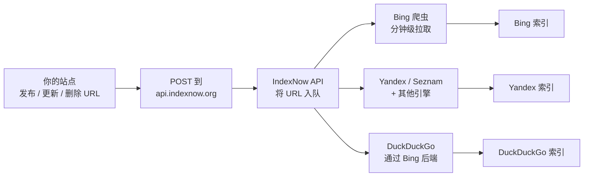

# Bing SEO 与 IndexNow — 站长工具、即时收录与提交

**Bing** 是微软的搜索引擎，2026 年占据全球搜索市场约 **3.5%**。
Bing 与 **DuckDuckGo**、**Ecosia**、**Yahoo**（自 2009 年起）以及
其他几个小引擎共享后端。为 Bing 优化一次，可以覆盖整个引擎族。

对 SEO 来说，亮点功能是 **IndexNow**——一个由 Bing 共同开发的协议，
让你在添加、更新或删除 URL 时 ping 一个端点。URL 在**分钟**级
别被爬取和收录，而非天级别。

> **TL;DR。** Bing SEO = Webmaster Tools + IndexNow + 与 Google
> 相似的排名因素。IndexNow 给你即时收录。Bing 与 Yahoo 与其他
> 小引擎共享；为 Bing 优化一次，覆盖整个引擎族。

## 为什么 Bing？

- **全球搜索市场约 3.5%**（StatCounter 2026 Q2）。
- **美国桌面搜索市场约 6.5%**（美国更高）。
- **与 Yahoo、DuckDuckGo、Ecosia 共享后端**——Bing 的索引支撑
  大多数。
- **Microsoft 生态集成**——Windows Start、Edge、Office、Copilot、
  MSN。
- **IndexNow**——即时收录协议。

## Bing Webmaster Tools — 免费工具

**Bing Webmaster Tools（BWT）**是每个做 Bing SEO 的人都需要的免费
工具。Google Search Console 的镜像。

### 设置

1. 访问 <https://www.bing.com/webmasters>。
2. 添加站点——通过以下方式验证：
   - **Bingbot XML 文件上传**——根目录的 `BingSiteAuth.xml`。
   - **Meta 标签**——`<meta name="msvalidate.01" content="...">`。
   - **DNS CNAME**——`bing.com` 验证记录。
   - **从 Google Search Console 导入**——如果你已在 GSC 验证过，
     这是最简单的。
3. 验证后，BWT 在 24-72 小时内开始收集数据。

### 每日 / 每周工作流

1. **仪表盘** → 概览：爬取问题、收录页面、流量、人工操作。
2. **报告 → SEO** → 页面问题、关键词分析、反向链接分析。
3. **URL 检查** → 提交 URL，查看爬取状态，阻止，重新收录。
4. **Sitemap** → 提交 XML sitemap。
5. **IndexNow** → 提交 URL（见下文的亮点功能）。
6. **爬取控制** → 按目录阻止 / 允许爬虫。
7. **人工操作** → 看 Bing 是否处罚过你的站。

## IndexNow — 即时收录

**IndexNow** 是微软 Bing 与 Yandex（后来 Seznam、Naver、DuckDuckGo
等加入）共同开发的协议。URL 添加、更新或删除即提交，引擎会在
几分钟内爬取。

### 为什么重要

传统收录：

- 发布 URL → 等下一次爬取周期（小站要几天到几周）。
- 提交 sitemap → 等 Bing 处理（小时级别）。

用 IndexNow：

- 发布 URL → POST 到 IndexNow API → URL 在几分钟内被拉取。
- URL 更新 → 再次 POST → 重新爬取。
- URL 删除 → POST 删除 → 从索引中移除。

### IndexNow 如何工作



### 生成 API key

1. 访问 <https://www.indexnow.org/> 并点击 **Get Started**。
2. 生成 key——至少 8 个字符，小写字母数字。例：
   `a1b2c3d4e5f6g7h8`。
3. 把 key 作为一个文本文件托管在根目录：
   `https://example.com/a1b2c3d4e5f6g7h8.txt`。文件内容必须
   是 key。
4. 对所有 URL 使用同一 key。

### 提交单个 URL

```sh
curl "https://api.indexnow.org/indexnow?url=https%3A%2F%2Fexample.com%2Fnew-page&key=a1b2c3d4e5f6g7h8"
```

### 提交多个 URL

```sh
# 通过 JSON 批量提交
curl -X POST "https://api.indexnow.org/indexnow" \
  -H "Content-Type: application/json" \
  -d '{
    "host": "example.com",
    "key": "a1b2c3d4e5f6g7h8",
    "keyLocation": "https://example.com/a1b2c3d4e5f6g7h8.txt",
    "urlList": [
      "https://example.com/new-page-1",
      "https://example.com/new-page-2",
      "https://example.com/new-page-3"
    ]
  }'
```

限制：

- 每次 POST 10,000 URL。
- 速率限制每秒 1 次请求。
- URL 必须绝对、percent-encoded。

### 从 CMS 提交 URL

大多数 CMS 自带 IndexNow 支持：

- **WordPress** — 微软的 *IndexNow Plugin*。
- **Drupal** — IndexNow 模块。
- **Shopify** — 通过应用部分支持。
- **自定义 CMS** — 从发布工作流 POST 到 API。

## 2026 年 Bing 排名因素

Bing 的排名因素与 Google 显著重叠但有区别。

### Bing 与 Google 一致的地方

- **内容质量 + E-E-A-T 类信号。**
- **反向链接**——质量与数量都重要。
- **HTTPS。**
- **移动友好。**
- **页面速度。**
- **结构化数据**——Bing 用 Schema.org JSON-LD。

### Bing 不同的地方

- **社交信号更重要。** Bing 官方比 Google 更重视社交分享
  （Twitter、Facebook、Reddit 等）。
- **精确匹配关键词。** Bing 更字面化——标题、URL、正文中的精确
  关键词更重要。
- **域名年龄。** Bing 比 Google 更看重域名年龄。
- **多媒体。** Bing 对有图、视频、音频的页面奖励更多。
- **Wikipedia / 权威目录列表。** Bing 给权威目录更多权重
  （DMOZ 衍生、Wikipedia）。

### Bing 专属技术因素

- **分页标签**——Bing 偏好 `<link rel="next">` /
  `<link rel="prev">`。
- **`robots.txt`**——必须允许 Bingbot。
- **XML sitemap**——提交到 BWT。
- **干净 URL**——描述性，无过多参数。
- **多语言站点**——用 `hreflang` 明确。

## Bing 处罚

Bing 可以处罚你的站：

| 类型 | 如何检测 | 如何修复 |
| --- | --- | --- |
| **伪装** | BWT → 人工操作 | 对爬虫和用户返回相同内容。 |
| **链接作弊** | BWT → 人工操作 | 拒绝或移除坏链。 |
| **薄内容** | 覆盖报告 | 增值或删除。 |
| **关键词堆砌** | SEO 报告 | 为人写。 |
| **隐藏文本** | 人工审查 | 没有隐藏文本。 |

大多数"Google 处罚"不会直接映射到 Bing——Bing 的垃圾容忍度有时
更宽，有时更严。定期检查 BWT。

## Bing Webmaster Tools vs Google Search Console

| 功能 | Bing Webmaster Tools | Google Search Console |
| --- | --- | --- |
| 收录状态 | ✅ | ✅ |
| 提交 URL | ✅（IndexNow——即时） | ✅（URL 检查——手动） |
| Sitemap | ✅ | ✅ |
| 反向链接 | ✅（有限） | ✅（链接报告） |
| 关键词 / 查询 | ✅ | ✅ |
| Core Web Vitals | ⚠️（第三方） | ✅（CrUX） |
| 移动可用性 | ✅ | ✅ |
| 人工操作 | ✅ | ✅ |
| 结构化数据 | ✅ | ✅（增强功能） |
| IndexNow | ✅ | ❌ |

## Bing + IndexNow 速查清单

30 分钟清单：

- [ ] 站点在 Bing Webmaster Tools 已验证（如可能从 GSC 导入）。
- [ ] Sitemap 已提交到 BWT。
- [ ] `robots.txt` 允许 `Bingbot`。
- [ ] IndexNow API key 已生成。
- [ ] Key 文件托管在
  `https://example.com/<key>.txt`。
- [ ] CMS 钩到 IndexNow 在发布 / 更新 / 删除时 POST。
- [ ] 手动向你最重要的 10 个 URL 提交 IndexNow。
- [ ] 24h 后检查 BWT——提交的 URL 应出现在覆盖中。

## 下一步？

- **4-yahoo** — Yahoo Search（由 Bing 提供）。
- **5-duckduckgo** — DuckDuckGo（由 Bing + 其他来源提供）。
- **6-baidu** — 百度（中文）。
- **7-shenma** — 神马（移动端，中文）。

## 源码与官方资源

- **Bing Webmaster Tools：** <https://www.bing.com/webmasters>
- **IndexNow：** <https://www.indexnow.org/>
- **Bing Webmaster Blog：** <https://blogs.bing.com/webmaster/>
- **Bingbot 文档：**
  <https://www.bing.com/webmasters/help/bergoly-crawler-faqs>