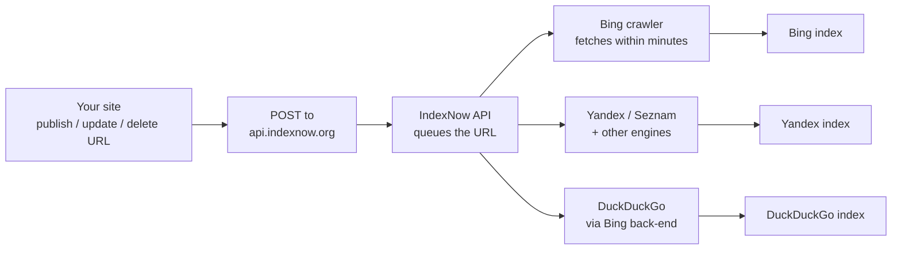

# Bing SEO and IndexNow — Webmaster Tools, Instant Indexing, and Submission

**Bing** is Microsoft's search engine, holding roughly **3.5%
of the global search market** as of 2026. Bing shares the
back-end with **DuckDuckGo**, **Ecosia**, **Yahoo** (since
2009), and several other smaller engines. Optimizing for Bing
gives you coverage across this whole family.

The headline feature for SEOs is **IndexNow** — a protocol
Bing co-developed that lets you ping a single endpoint when
you add, update, or delete a URL. URLs are crawled and
indexed within minutes, not days.

> **TL;DR.** Bing SEO = Webmaster Tools + IndexNow + similar
> ranking factors to Google. IndexNow gives you instant
> indexing. Bing is shared with Yahoo and other small engines;
> optimize for Bing once, get coverage across the family.

## Why Bing?

- **~3.5% global search market** (StatCounter Q2 2026).
- **~6.5% US desktop search market** (higher in the US).
- **Shared back-end with Yahoo, DuckDuckGo, Ecosia** — Bing's
  index powers most of these.
- **Microsoft ecosystem integration** — Windows Start, Edge,
  Office, Copilot, MSN.
- **IndexNow** — instant indexing protocol.

## Bing Webmaster Tools — the free tool

**Bing Webmaster Tools (BWT)** is the free tool every Bing
SEO needs. Mirror of Google Search Console.

### Setup

1. Go to <https://www.bing.com/webmasters>.
2. Add a site — verify via:
   - **Bingbot XML file upload** — `BingSiteAuth.xml` at the
     root.
   - **Meta tag** — `<meta name="msvalidate.01" content="...">`.
   - **DNS CNAME** — `bing.com` validation record.
   - **Import from Google Search Console** — easiest if you
     already verified there.
3. Once verified, BWT starts collecting data within 24-72
   hours.

### Daily / weekly workflow

1. **Dashboard** → overview: crawl issues, indexed pages,
   traffic, manual actions.
2. **Reports → SEO** → on-page issues, keyword analysis,
   backlink analysis.
3. **URL Inspection** → submit URLs, view crawl status,
   block, re-index.
4. **Sitemaps** → submit XML sitemaps.
5. **IndexNow** → submit URLs (the headline feature, see
   below).
6. **Crawl Control** → block / allow bots per directory.
7. **Manual Actions** → see if Bing has penalized your site.

## IndexNow — instant indexing

**IndexNow** is a protocol co-developed by Microsoft Bing
and Yandex (joined by Seznam, Naver, DuckDuckGo, and others).
Submit a URL as soon as it's added, updated, or deleted, and
the engines will crawl it within minutes.

### Why it matters

Traditional indexing:

- Publish URL → wait for the next crawl cycle (days to weeks
  for small sites).
- Submit a sitemap → wait for Bing to process it (hours).

With IndexNow:

- Publish URL → POST to IndexNow API → URL is fetched
  within minutes.
- Updated URL → POST again → re-crawled.
- Deleted URL → POST the deletion → removed from the index.

### How IndexNow works



### Generate an API key

1. Visit <https://www.indexnow.org/> and click **Get Started**.
2. Generate a key — at least 8 characters, lowercase
   alphanumeric. Example: `a1b2c3d4e5f6g7h8`.
3. Host the key as a text file at your root:
   `https://example.com/a1b2c3d4e5f6g7h8.txt`. The file's
   content must be the key.
4. Use the same key for all your URLs.

### Submit a single URL

```sh
curl "https://api.indexnow.org/indexnow?url=https%3A%2F%2Fexample.com%2Fnew-page&key=a1b2c3d4e5f6g7h8"
```

### Submit multiple URLs

```sh
# Submit a batch via JSON
curl -X POST "https://api.indexnow.org/indexnow" \
  -H "Content-Type: application/json" \
  -d '{
    "host": "example.com",
    "key": "a1b2c3d4e5f6g7h8",
    "keyLocation": "https://example.com/a1b2c3d4e5f6g7h8.txt",
    "urlList": [
      "https://example.com/new-page-1",
      "https://example.com/new-page-2",
      "https://example.com/new-page-3"
    ]
  }'
```

Limits:

- 10,000 URLs per POST.
- 1 request per second rate limit.
- URL must be absolute, percent-encoded.

### Submit URLs from your CMS

Most CMSes have IndexNow support out of the box:

- **WordPress** — plugins like *IndexNow Plugin* by Microsoft.
- **Drupal** — IndexNow module.
- **Shopify** — partial support via apps.
- **Custom CMS** — POST to the API from your publish
  workflow.

## Bing's ranking factors in 2026

Bing's ranking factors overlap significantly with Google's
but have some distinct emphases.

### Where Bing agrees with Google

- **Content quality + E-E-A-T-like signals.**
- **Backlinks** — quality and quantity matter.
- **HTTPS.**
- **Mobile-friendly.**
- **Page speed.**
- **Structured data** — Bing uses Schema.org JSON-LD.

### Where Bing differs

- **Social signals matter more.** Bing officially weighs
  social shares (Twitter, Facebook, Reddit, etc.) more
  heavily than Google does.
- **Exact-match keywords.** Bing is more literal — exact
  keyword in title, URL, body is more important.
- **Domain age.** Bing weighs domain age slightly more than
  Google.
- **Multimedia.** Bing rewards pages with images, video,
  audio — sometimes more than Google.
- **Wikipedia / authoritative directory listings.** Bing
  gives more weight to authoritative directories
  (DMOZ-derived, Wikipedia).

### Bing-specific technical factors

- **Pagination tags** — Bing prefers `<link rel="next">` /
  `<link rel="prev">` on paginated content.
- **`robots.txt`** — must allow Bingbot.
- **XML sitemap** — submit to BWT.
- **Clean URLs** — descriptive, no excessive parameters.
- **Multilingual sites** — use `hreflang` for clarity.

## Bing penalties

Bing can penalize your site for:

| Type | How to detect | How to fix |
| --- | --- | --- |
| **Cloaking** | BWT → Manual Actions | Same content for bot and user. |
| **Link spam** | BWT → Manual Actions | Disavow or remove bad links. |
| **Thin content** | Coverage reports | Add value or remove. |
| **Keyword stuffing** | SEO reports | Write for humans. |
| **Hidden text** | Manual review | No hidden text. |

Most "Google penalties" don't translate directly to Bing —
Bing's spam tolerance is sometimes more lenient, sometimes
stricter. Check BWT regularly.

## Bing Webmaster Tools vs Google Search Console

| Feature | Bing Webmaster Tools | Google Search Console |
| --- | --- | --- |
| Indexing status | ✅ | ✅ |
| Submit URLs | ✅ (IndexNow — instant) | ✅ (URL Inspection — manual) |
| Sitemaps | ✅ | ✅ |
| Backlinks | ✅ (limited) | ✅ (Links report) |
| Keywords / queries | ✅ | ✅ |
| Core Web Vitals | ⚠️ (third-party) | ✅ (CrUX) |
| Mobile Usability | ✅ | ✅ |
| Manual Actions | ✅ | ✅ |
| Structured data | ✅ | ✅ (Enhancements) |
| IndexNow | ✅ | ❌ |

## Quick Bing + IndexNow checklist

A 30-minute checklist:

- [ ] Site verified in Bing Webmaster Tools (import from GSC
  if possible).
- [ ] Sitemap submitted to BWT.
- [ ] `robots.txt` allows `Bingbot`.
- [ ] IndexNow API key generated.
- [ ] Key file hosted at
  `https://example.com/<key>.txt`.
- [ ] CMS hooked up to POST to IndexNow on publish / update
  / delete.
- [ ] Submit your top 10 most important URLs to IndexNow
  manually.
- [ ] Check BWT after 24h — submitted URLs should appear in
  Coverage.

## What's next?

- **4-yahoo** — Yahoo Search (powered by Bing).
- **5-duckduckgo** — DuckDuckGo (powered by Bing + other
  sources).
- **6-baidu** — Baidu (Chinese-language).
- **7-shenma** — Shenma (mobile, Chinese).

## Source & Official Resources

- **Bing Webmaster Tools:** <https://www.bing.com/webmasters>
- **IndexNow:** <https://www.indexnow.org/>
- **Bing Webmaster Blog:** <https://blogs.bing.com/webmaster/>
- **Bingbot documentation:**
  <https://www.bing.com/webmasters/help/bergoly-crawler-faqs>